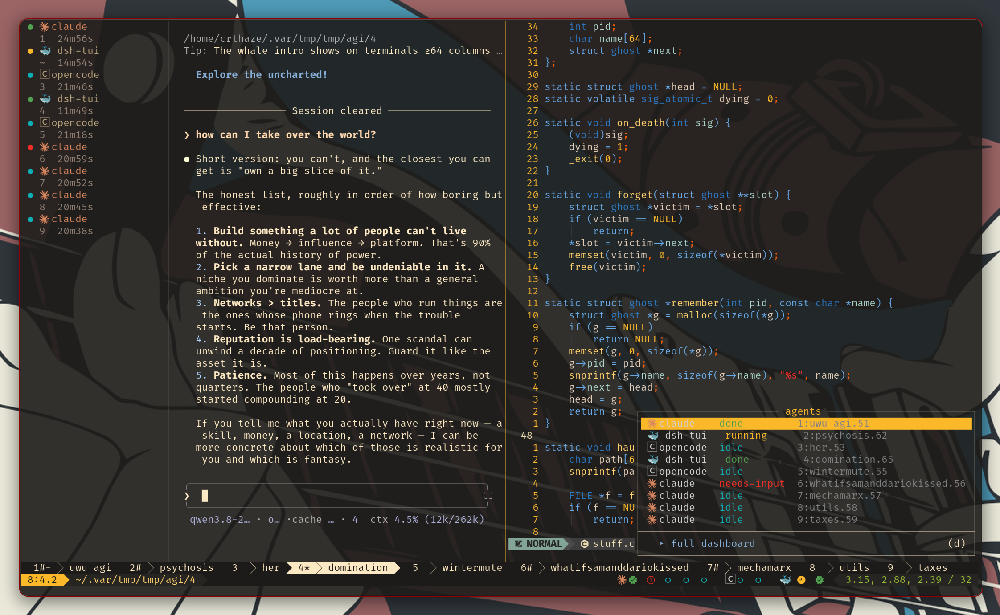
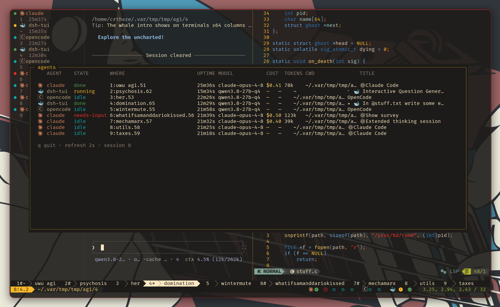

# tmux-handlr: coding-agent status for tmux

A **tmux plugin** that shows the live state of every coding agent you have running
(Claude Code, Codex, OpenCode, Gemini CLI, Copilot, Cursor, and more) as status-line dots,
a switcher menu, a dashboard, and a sidebar, with push notifications when an agent
finishes or is waiting on you.



> Herdr is a great agent tracker, it's just missing a good multiplexer.

tmux users can now get [Herdr](https://github.com/herdrdev/herdr)-style harness status
information without having to switch away from their favorite multiplexer.

*(Note: Herdr is actually a pretty performant multiplexer and no slander against
Herdr, its users, its developers, or their coding agents is intended.)*

## What This Does

Live status for coding-agent panes in tmux. `handlr` reports, per pane, whether the agent
is **working**, **needs input**, **done**, or **idle**; you see it as clickable status-line
dots, a `prefix + a` switcher menu, and a `prefix + A` detail dashboard (also available as a
toggle-able **sidebar** pane), plus an optional [ntfy](https://ntfy.sh) push when an agent
finishes or stalls on a prompt.



Out of the box it detects **claude, codex, opencode, dsh (deepseek)**, plus every agent
[herdr](https://github.com/herdrdev/herdr) ships rules for (cursor, gemini, amp, cline, …).

## Why the state is right

Most tmux agent-status tools read file mtimes and guess. A long tool call then looks
"done" the moment the transcript pauses, an idle prompt lingers as "working" for minutes,
and "needs input" works for at most one agent. `handlr` takes herdr's approach instead: a
background daemon reads each pane's **OSC title** (`#{pane_title}`) and **rendered screen**
(`tmux capture-pane`) and matches both against a prioritized per-agent ruleset. The
bundled rules are herdr's, under Apache-2.0, kept current by a scheduled sync; the
timestamp heuristic only kicks in when a pane has no rules or the daemon is down, so the
UI never goes blank.

Dots, menu, and dashboard all read the same state cache the daemon writes, which is why
they can't disagree.

## Install

With [TPM](https://github.com/tmux-plugins/tpm), add this to `~/.tmux.conf`:

```tmux
set -g @plugin 'CRThaze/tmux-handlr'
```

then hit `prefix + I`. `handlr.tmux` starts the detection daemon and binds `prefix + a`
/ `prefix + A`, unless you disable either.

The clickable **dots** ride on a [tmux-powerline](https://github.com/erikw/tmux-powerline)
segment: add `agent_pane_dots` to your theme's segment list and make the segment file
available to powerline (see [Status-line dots](#status-line-dots)).

## Requirements

- tmux 3.x, bash, `ps`
- `python3` **3.6+** for the detection engine, **standard library only, no pip installs**
- A **Nerd Font** (recommended): the default `claude`/`codex`/`copilot` labels and the
  `symbolic`-mode badges are Nerd Font glyphs. Without one, override them with plain-Unicode
  glyphs via `@handlr-agent-glyphs` and `@handlr-glyph-*` (see [Options](#options)); the `dots`
  indicator and its pie-fill animation are plain Unicode and need no special font.
- [tmux-powerline](https://github.com/erikw/tmux-powerline): needed for the status-line
  indicator as a powerline **segment**. Skipping powerline? Use the plain `status-right`
  fallback (see [Status-line dots](#status-line-dots)); the menu, dashboard, and
  notifications work either way.
- `curl`: optional, only for `detection-sync.sh` and ntfy notifications

## Supported agents

Detected out of the box (in the default `@handlr-processes`), with their default label glyph.
State comes from herdr's screen-detection rules (`herdr ✓`) except where noted; every glyph is
overridable with [`@handlr-agent-glyphs`](#options).

| Agent                   | Glyph | Matched process name(s) | State detection |
|-------------------------|-------|-------------------------|-----------------|
| Claude Code             | (nf)  | `claude`                | herdr pattern ✓ |
| Codex                   | (nf)  | `codex`                 | herdr pattern ✓ |
| GitHub Copilot          | (nf)  | `copilot`               | herdr pattern ✓ |
| opencode                | 🄲     | `opencode`, `opencode2` | herdr pattern ✓ |
| Gemini CLI              | ♊    | `gemini`                | herdr pattern ✓ |
| Qwen Code               | Ⓠ     | `qwen`                  | herdr pattern ✓ |
| Grok CLI                | 𝕏     | `grok`                  | herdr pattern ✓ |
| Cursor (`cursor-agent`) | ▮     | `cursor`                | herdr pattern ✓ |
| Cline                   | ❯     | `cline`                 | herdr pattern ✓ |
| Kiro                    | Ⓚ     | `kiro`                  | herdr pattern ✓ |
| Devin (terminal)        | Ⓓ     | `devin`                 | herdr pattern ✓ |
| Maki                    | ◎     | `maki`                  | herdr pattern ✓ |
| Kimi                    | ☽     | `kimi`                  | herdr pattern ✓ |
| Qoder                   | 🅀     | `qoder`/`qodercli`      | herdr pattern ✓ |
| Antigravity             | ⇧     | `agy`                   | herdr pattern ✓ |
| dsh (deepseek TUI)      | 🐳    | `dsh` + self-report     | ours (`dsh-tui`) |
| aider                   | æ     | `aider`                 | **mtime only**: herdr ships no aider rules |

Notes:
- **Fonts:** `claude`, `codex`, `copilot` are Nerd Font glyphs; the rest are plain Unicode and
  render anywhere (see the Nerd Font note under [Options](#options)).
- **Future brand glyphs:** `gemini`, `grok`, `kimi` have real brand codicons upstream
  (U+ECD1 / U+ECEC / U+ECD2) that aren't in the current Nerd Fonts release yet; they use Unicode
  now and can be swapped when the font updates. `kiro`'s mascot is a ghost: try nf `fa-ghost`
  (U+EEFE) via `@handlr-agent-glyphs` if your font has it.
- **Excluded by default (false-positive-prone tokens):** `pi` (2 chars), `amp` (3 chars, matches
  paths/sockets), `hermes` (collides with React Native's `hermes` engine). herdr *does* have rules
  for them; enable the one(s) you run with `set -g @handlr-extra-processes 'pi,amp,hermes'`
  (appends to the default; at your own risk), or, if the harness can call it, self-report via
  `scripts/agent-state.sh --agent <name> --state …` (no false-positive risk).
- Any agent not listed falls back to 🤖 and the mtime heuristic.

## How it works

```
handlr.tmux ──starts──▶ detect.py --daemon ──loops every ~1.5s──▶ state cache (TSV)
                              │                                         │
             reads OSC title + capture-pane, matches                  read by
             detection/*.json rules (herdr-derived)                   ▼
                                              agent_pane_dots segment · prefix+a menu · prefix+A dashboard
```

Per pane, each tick resolves state in order:

1. **Authoritative override:** a state a harness reported about itself via
   `scripts/agent-state.sh` (e.g. dsh through `dsh-herdr-agent-state`). Wins over everything.
2. **OSC title:** cheap; catches most claude/codex working/idle from `#{pane_title}` with
   no screen capture.
3. **Screen scrape:** `capture-pane` + the full prioritized ruleset (permission prompts,
   spinners, empty prompt box, …). This is what makes "needs input" work for every agent.
4. **Timestamp fallback:** the session-file mtime heuristic, used only when a pane has no
   manifest or the daemon isn't running.

The green **done** flash is synthesized by the daemon on a working/needs-input to idle edge.
It clears on its own after `@handlr-done-window`, or you can dismiss it early: bind a key via
`@handlr-dismiss-key`, or run `scripts/agent-dismiss.sh [%pane]` / `--all`.

## Options

| Option | Default | Meaning |
|---|---|---|
| `@handlr-setup-binds` | `on` | Bind the menu/dashboard keys. Set `off` to keep your own binds. |
| `@handlr-menu-key` | `a` | `prefix +` this opens the agent switcher menu. |
| `@handlr-dashboard-key` | `A` | `prefix +` this opens the detail dashboard. |
| `@handlr-popup-style` | `bg=default,fg=default` | Dashboard popup `-s` style. |
| `@handlr-popup-border-style` | `fg=default,bg=default` | Dashboard popup `-S` border style. |
| `@handlr-sidebar-key` | *(unset)* | `prefix +` this **toggles** a sidebar pane running the dashboard's compact layout. Opt-in: unset binds nothing, so pick a free key (e.g. `s`). |
| `@handlr-sidebar-width` | `24` | Sidebar pane width, in columns. |
| `@handlr-sidebar-position` | `left` | Which side the sidebar opens on: `left` or `right`. |
| `@handlr-dashboard-icons` | `on` | Show each agent's type glyph (as in the `prefix+a` menu) in the `prefix+A` dashboard and the sidebar. `off` = text only. |
| `@handlr-dismiss-key` | *(unset)* | `prefix +` this dismisses the **current pane's** done flash back to idle now. Opt-in: unset binds nothing. (`scripts/agent-dismiss.sh --all` clears every done pane at once.) |
| `@handlr-daemon` | `on` | Run the detection daemon. `off` means timestamp-fallback only. |
| `@handlr-processes` | *(the supported-agents set)* | Process names treated as agents (replaces the default list; see [Supported agents](#supported-agents)). |
| `@handlr-extra-processes` | *(unset)* | **Appends** to the default list: add agents without restating it (e.g. the excluded `pi,amp,hermes`, at your own risk). |
| `@handlr-running-window` | `20` | Fallback: seconds of write-activity that counts as running. |
| `@handlr-done-window` | `120` | Seconds the green "done" state persists before idle. |
| `@handlr-notify-command` | *(unset)* | Command run on notify-state edges (env: `AGENT_NAME/STATE/SESSION/WINDOW`). |
| `@handlr-notify-states` | `done,needs-input` | Which states fire `@handlr-notify-command`. |
| `@handlr-marker` | `on` | Honor the claude permission-marker accelerator (see [Hooks](#optional-claude-hooks)). |
| `@handlr-indicator` | `dots` | Indicator style: `dots` (● colored by state; the running dot animates) or `symbolic` (a distinct glyph per state). |
| `@handlr-dots-animate` | `on` | In `dots` mode, animate the running dot (cycles `@handlr-glyph-running`); `off` = static ●. |
| `@handlr-agent-glyphs` | *(built-in)* | Per-type label glyphs: `claude=✻,codex=🧠,dsh=🐳,default=🤖`. Overrides the built-ins; also used by the `prefix+a` menu. |
| `@handlr-glyph-running` | *(mode-dependent)* | Running-animation frames (space-separated). Default: `◔ ◑ ◕ ●` (pie-fill) in `dots` mode, `▘ ▝ ▗ ▖` (block orbit) in `symbolic`. An override applies to whichever mode is active. |
| `@handlr-glyph-needs-input` | nf-cod-unverified (U+EB76) | symbolic mode: the "needs input" glyph (shown red; pairs with the done badge). |
| `@handlr-glyph-done` | nf-cod-verified_filled (U+EBE9) | symbolic mode: the "done" glyph (shown green). |
| `@handlr-glyph-idle` | `○` | symbolic mode: the "idle" glyph. |
| `@handlr-color-running` | `yellow` | Color for the running state (any tmux color: name / `colourN` / `#hex`). |
| `@handlr-color-needs-input` | `red` | Color for the needs-input state. |
| `@handlr-color-done` | `green` | Color for the done state. |
| `@handlr-color-idle` | `cyan` | Color for the idle state. |
| `@handlr-label-color-claude` | `colour173` | Accent color for the claude type label. |

State colors default to **named** colors (so they follow your terminal palette) and are set per
state via `@handlr-color-*`; they apply to both modes and to the `prefix+a` menu. (The `prefix+A`
dashboard uses fixed ANSI equivalents.)

The **sidebar** (`@handlr-sidebar-key`) toggles a narrow pane showing the dashboard's compact,
stacked layout. tmux panes belong to a single window, so the sidebar is per-window: it opens
beside the window you trigger it from, and pressing the key again closes it.
`@handlr-agent-glyphs` keys match the agent type exactly, with a `dsh` key also covering `dsh-*`
interface variants and a `default=` catch-all. In `dots` mode the `-done`/`-needs-input`/`-idle`
glyph options are unused (those states are a solid `●`, distinguished by color); the running dot
uses `@handlr-glyph-running` when `@handlr-dots-animate` is on.

**Spin/animation rate:** the running indicator advances one frame per status redraw. tmux caches
the powerline `#()` segment's output and only re-runs it every `status-interval` (integer seconds),
so it's effectively **1 frame/sec**; there is no way to animate a powerline segment faster. Short,
high-contrast sets read as motion at 1/sec; long sets (e.g. a 10-frame braille spinner) look
sluggish. Set `@handlr-dots-animate off` (or a single-frame `@handlr-glyph-running`) for a static ●.

Ready-to-use frame sets (all single-cell and state-colored; `set -g @handlr-glyph-running '…'`):

| Name | Frames | Feel |
|---|---|---|
| pie-fill *(dots default)* | `◔ ◑ ◕ ●` | circle fills, loading |
| block orbit *(symbolic default)* | `▘ ▝ ▗ ▖` | block hops around corners |
| half-circles | `◐ ◓ ◑ ◒` | filled half rotates |
| clock arc | `◴ ◵ ◶ ◷` | quarter-arc sweeps |
| star twinkle | `✶ ✷ ✸ ✹` | pulsing star |
| arrows | `← ↑ → ↓` | rotating pointer |

> **Nerd Font note:** the built-in `claude` and `codex` labels are Nerd Font glyphs
> (nf-cod-claude U+EC82, nf-cod-openai U+EC81). If you don't use a
> [Nerd Font](https://www.nerdfonts.com/), override them with plain-Unicode glyphs
> (e.g. `set -g @handlr-agent-glyphs 'claude=✻,codex=✳,default=🤖'`, any asterisk/emoji works);
> otherwise they show as missing-glyph boxes. Even with a Nerd Font patched in, these glyphs
> tend not to render at font sizes below ~11. (`opencode`'s 🄲 and `dsh`'s 🐳 are plain Unicode
> and render anywhere.)

For back-compatibility, `@agent-indicator-processes`, `@agent-status-running-window`,
`@agent-status-done-window`, and `@agent-indicator-icons` (i.e. `@handlr-agent-glyphs`) are read as
fallbacks if the `@handlr-*` equivalents are unset.

## Status-line dots

**With tmux-powerline.** Powerline doesn't auto-discover segments, so put
`segments/agent_pane_dots.sh` where powerline looks (either your
`TMUX_POWERLINE_DIR_USER_SEGMENTS` dir or powerline's own `segments/`) and add
`agent_pane_dots` to your theme's `TMUX_POWERLINE_{LEFT,RIGHT}_STATUS_SEGMENTS`. The segment
finds the engine via `TMUX_HANDLR_DIR` (exported by `handlr.tmux`), so it works from any location.
To symlink it into place for you, run `scripts/install-segment.sh` (or set
`@handlr-install-segment 'on'` to have `handlr.tmux` do it on load); you still add the segment
name to your theme.

**Without powerline.** Use the plain `status-right` fallback: either add it yourself:

```tmux
set -ga status-right '#($HOME/.tmux/plugins/tmux-handlr/scripts/handlr-status.sh)'
```

or set `@handlr-status-right 'on'` and `handlr.tmux` appends that for you. (Skip this under
powerline: it rewrites `status-right` on every load and would drop it.)

Either way, each indicator carries a `range=user|<pane_id>` marker; add a `MouseDown1Status`
binding that matches `^%[0-9]+$` and jumps to the pane to make them click-to-jump.

## Notifications

Set `@handlr-notify-command` to any script; the daemon runs it once per state edge listed in
`@handlr-notify-states`, with `AGENT_NAME`, `AGENT_STATE`, `AGENT_SESSION`, `AGENT_WINDOW` in
the environment. A ready ntfy pusher ships in `scripts/agent-ntfy-notify.sh`; it reads the
server/topic/token from an env file (default
`~/.config/herdr/plugins/config/zom-2018.herdr-ntfy-notify/.env`, overridable with
`AGENT_NTFY_ENV`) so **no secret lives in this repo**.

## Optional: claude hooks

Two optional claude hooks sharpen detection:

- **PermissionRequest** runs `d="${XDG_CACHE_HOME:-$HOME/.cache}/agent-state/needs-input"; [ -n "$TMUX_PANE" ] || exit 0; mkdir -p "$d"; touch "$d/$TMUX_PANE"`
  makes a blocked claude pane show instantly (accelerator; screen-scraping catches it anyway).
- **Stop** runs `[ -n "$TMUX_PANE" ] || exit 0; rm -f "${XDG_CACHE_HOME:-$HOME/.cache}/agent-state/needs-input/$TMUX_PANE"`
  clears that marker.

The `[ -n "$TMUX_PANE" ] || exit 0` guard is required: when claude runs outside tmux (or in a
context that doesn't inherit `$TMUX_PANE`), an unguarded command collapses to the marker
*directory* and `rm`/`touch` errors out in the hook.

## Self-reporting agents (dsh, etc.)

Agents that aren't a recognizable process, or that know their own state, can report it:

```sh
scripts/agent-state.sh --agent dsh-tui --state running   # running | needs-input | done | idle | off
```

Use an interface-specific id (`dsh-tui`, `dsh-web`, …) so distinct interfaces of the same
harness don't collide; ship a matching `detection/<id>.json` (or alias it) for the
screen-scrape fallback.

This tags the pane's agent type and records an authoritative state the daemon honors above
screen-scraping. `off` hands detection back. `$TMUX_PANE` is used if `--pane` is omitted.

## Detection rules & updates

Rules live as JSON under `detection/` (converted from herdr's TOML; `UPSTREAM.json` records
the source commit). At runtime a refreshed copy in
`${XDG_DATA_HOME:-~/.local/share}/tmux-handlr/detection/` wins over the bundle.

- **Manual refresh:** `scripts/detection-sync.sh` (needs python 3.11+ for the TOML read).
- **Automatic:** the `sync-detection` GitHub Action tracks `herdrdev/herdr` weekly, validates
  every change (JSON Schema + regex ReDoS smoke test + engine self-test), and opens a PR for
  review. Validation failures or an upstream `schema_version` bump fail the run and file an
  issue instead; nothing unreviewed is merged.

## Development

```sh
python3 scripts/detect.py --selftest        # engine unit checks (fixtures)
python3 scripts/detect.py --pane %5 --type claude   # resolve one live pane
python3 scripts/sync_detection.py --check-only --out detection   # validate bundled JSON
```

Test locally without publishing: symlink `~/.tmux/plugins/tmux-handlr` to your checkout, then
`prefix + r`.

## FAQ

### How do I get notified when Claude Code (or any agent) finishes in tmux?

Set `@handlr-notify-command` to a script; the daemon runs it on every `done` and
`needs-input` edge. `scripts/agent-ntfy-notify.sh` is a ready-made [ntfy](https://ntfy.sh)
pusher, so your phone buzzes when an agent finishes or asks for permission. See
[Notifications](#notifications).

### How do I see which tmux pane is waiting for input?

Panes in the `needs-input` state show a red dot in the status line, red text in the
`prefix + a` menu and `prefix + A` dashboard, and are listed in the sidebar. Pick the entry in
the menu to jump there, or click the dot once you add the mouse binding from
[Status-line dots](#status-line-dots).

### Is this a herdr alternative for tmux?

It is a herdr companion for tmux, not a replacement. It reuses herdr's detection rules and
gives you the same per-agent state inside tmux, without a separate multiplexer. If you already
live in tmux, this is the piece herdr is missing.

### Does it work with Codex, OpenCode, Gemini CLI, Copilot, Cursor, aider?

Yes for all of the above and more; see [Supported agents](#supported-agents). aider has no
upstream rules and falls back to the timestamp heuristic. Anything else can self-report
via `scripts/agent-state.sh`.

### Does it need Python packages or a daemon?

The detection engine is Python 3.6+ standard library only, no pip installs. A small
background daemon polls panes every ~1.5s; disable it with `@handlr-daemon off` to fall
back to the mtime heuristic.

## License

Apache-2.0; see [`LICENSE`](LICENSE). The bundled detection manifests under `detection/` are
derived from [herdr](https://github.com/herdrdev/herdr) and remain Apache-2.0 © Herdr, Inc.;
see [`NOTICE`](NOTICE).
